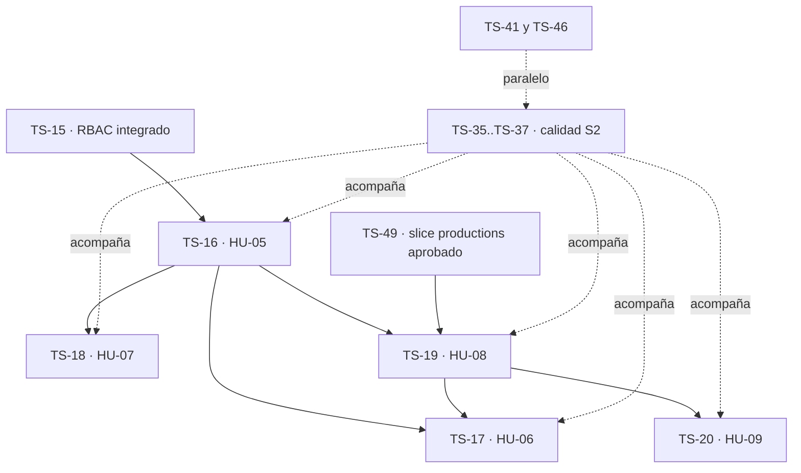

# Sprint 2 - Artistas y producciones

**Estado:** baseline aprobada y reconciliada con Jira el 2026-10-02. `TS Sprint 2` es el sprint futuro id 37; Jira manda sobre estado, checklist y criterios de aceptación.
**Ventana:** 2026-10-05 a 2026-10-16. **Release:** R1 - Núcleo interno (MVP).
**Selección funcional:** `TS-16`..`TS-20` (13 SP). **Reserva transversal:** 2 SP equivalentes para trabajo incremental de `TS-35`..`TS-37` (HU-24..HU-26), sin contar los SP dos veces.
**Tasks:** `TS-41` (dominio/DNS), `TS-46` (evidencia de desarrollo) y `TS-49` (ERD completo).
**Formato:** [campos y reglas de expansión](../backlog-format.md) · catálogo en [jira-backlog.md](../jira-backlog.md) · secuencia en [roadmap.md](../roadmap.md).

## Objetivo

Entregar en staging el primer flujo administrativo de dominio: el productor registra, edita, lista y cambia el estado de artistas, y administra producciones con las reglas de formato acordadas. En paralelo, el sprint deja el ERD completo aprobado, evidencia de desarrollo trazable y cobertura incremental de calidad para evitar concentrar QA al final del proyecto.

TS-15 quedó en `Listo` el 2026-10-02 con sus checklists e integración de staging cerradas. Su contrato RBAC es una precondición satisfecha para las historias de productor de S2.

## Capacidad y compromiso

| Tipo                  | Alcance                                                   |                              Capacidad |
| --------------------- | --------------------------------------------------------- | -------------------------------------: |
| Historias funcionales | HU-05..HU-09                                              |                                  13 SP |
| Calidad transversal   | Avance verificable de HU-24..HU-26 sobre la superficie S2 |                      2 SP equivalentes |
| Tasks sin SP          | TS-41, TS-46 y TS-49                                      | Consumen la misma capacidad del sprint |
| **Objetivo total**    | Funcional + transversal                                   |                 **15 SP equivalentes** |

Las Tasks no se convierten artificialmente a SP. Si su esfuerzo real amenaza el objetivo, se registra el consumo y se escala capacidad o espera externa; no se elimina alcance.

## Registros del sprint

| Jira  | ID local | Tipo  |  SP | Título                                          | Dependencias de entrega                    |
| ----- | -------- | ----- | --: | ----------------------------------------------- | ------------------------------------------ |
| TS-16 | ts-05    | Story |   3 | HU-05 Registrar y editar artistas               | Contrato RBAC de TS-15 satisfecho          |
| TS-17 | ts-06    | Story |   2 | HU-06 Listar artistas con estado y producciones | TS-16 y TS-19 para aceptación completa     |
| TS-18 | ts-07    | Story |   2 | HU-07 Cambiar el estado de un artista           | TS-16                                      |
| TS-19 | ts-08    | Story |   3 | HU-08 Registrar, editar y eliminar producciones | TS-16 y slice `productions` de TS-49       |
| TS-20 | ts-09    | Story |   3 | HU-09 Validar restricciones de formato          | TS-19; contrato de formato aprobado en TS-49 |
| TS-41 | ts-30    | Task  |   — | Configurar dominio y DNS                        | Acción humana externa                      |
| TS-46 | ts-35    | Task  |   — | Tesis: evidencia de desarrollo por sprint       | Evidencia de las entregas                  |
| TS-49 | ts-38    | Task  |   — | Diseñar y cerrar el ERD                         | Aprobación humana del diseño               |

TS-17 puede iniciar su spec y el listado de artistas después de TS-16, pero no cumple su aceptación completa hasta que TS-19 permita demostrar producciones asociadas. Esta dependencia quedó enlazada en Jira el 2026-10-02.

## Secuencia de ejecución

Orden recomendado:

1. Mantener alineado en Jira el alcance ya cargado en `TS Sprint 2`.
2. Aprobar primero el slice de `productions` en TS-49 (hecho el 2026-10-05). Las reglas de formato de HU-09 cuentan canciones, no minutos (decisión del 2026-10-05), así que ya no dependen de la duración del audio.
3. Ejecutar TS-16 con el ciclo SDD/TDD completo.
4. Tras TS-16, avanzar TS-18 y TS-19 en paralelo; TS-17 puede comenzar, pero su integración completa espera TS-19.
5. Ejecutar TS-20 después de TS-19.
6. Capturar TS-41, TS-46 y la evidencia de HU-24..HU-26 durante el sprint, no al final.

## Condiciones de Ready

Una Story entra al ciclo cuando:

- sus criterios de aceptación están vigentes en Jira;
- no depende de un punto ABIERTO del ADR;
- el slice de ERD que necesita está aprobado;
- se encuentra fuera de los vetos vigentes de `CLAUDE.md` §5;
- el contrato RBAC de TS-15 permanece integrado y verificable;
- la spec de capa se escribe y aprueba antes de los tests (C1).

## Desglose funcional

Los criterios de aceptación no se copian aquí: Jira es su fuente de verdad. Las casillas preparan la ejecución y deben reconciliarse con la Description de cada ticket antes de comenzar.

### TS-16 / ts-05 - HU-05 Registrar y editar artistas

Alcance del sprint: alta y edición por productor sobre el modelo `artists` ya aprobado. Excluye cambio de estado (TS-18) y acceso del artista a producciones (HU-20).

- [ ] `ts-05.01` Spec backend. Hecho cuando: `docs/specs/backend/HU-05.md` está aprobada, referencia los AC de Jira y define validación, unicidad, autorización, persistencia y errores D3.1. Orden interno: TS-54 y contrato TS-15.
- [ ] `ts-05.02` Tests backend en rojo. Hecho cuando: los casos de alta/edición, duplicados, validación, autorización y no encontrado fallan por la razón correcta. Orden interno: ts-05.01.
- [ ] `ts-05.03` Código backend hasta verde (humano). Hecho cuando: migración/modelo/servicio/controlador autorizados por la spec; tests, Larastan y Pint limpios. Orden interno: ts-05.02.
- [ ] `ts-05.04` Review backend. Hecho cuando: hallazgos resueltos o justificados y cada test no trivial fue probado en rojo (C3). Orden interno: ts-05.03.
- [ ] `ts-05.05` Spec frontend. Hecho cuando: `docs/specs/frontend/HU-05.md` está aprobada y define formulario, estados, errores y contrato con backend sin duplicarlo. Orden interno: ts-05.01.
- [ ] `ts-05.06` Tests frontend en rojo. Hecho cuando: alta/edición, validación, duplicados, permisos y estados asíncronos fallan por la razón correcta. Orden interno: ts-05.05.
- [ ] `ts-05.07` Código frontend hasta verde (humano). Hecho cuando: tests, TypeScript, ESLint y Prettier limpios. Orden interno: ts-05.06.
- [ ] `ts-05.08` Review frontend. Hecho cuando: hallazgos resueltos o justificados y C3 demostrada. Orden interno: ts-05.07.
- [ ] `ts-05.09` Integración y cierre. Hecho cuando: PR a `develop`, CI verde, productor crea/edita en staging, artista queda rechazado y AC/RNF aplicables tienen evidencia. Orden interno: ts-05.04, ts-05.08 y TS-15 integrado.

### TS-17 / ts-06 - HU-06 Listar artistas con estado y producciones

Alcance del sprint: listado ordenado con estado y producciones asociadas. Excluye métricas del dashboard y estadísticas no respaldadas por RF.

- [ ] `ts-06.01` Spec backend aprobada con consulta, orden, forma de respuesta, autorización y comportamiento sin resultados. Orden interno: ts-05.01; puede prepararse antes de cerrar TS-19.
- [ ] `ts-06.02` Tests backend en rojo para orden, estado, asociaciones, vacío y permisos. Orden interno: ts-06.01.
- [ ] `ts-06.03` Código backend hasta verde (humano), sin N+1 y con Larastan/Pint limpios. Orden interno: ts-06.02 y backend TS-19 disponible para la asociación completa.
- [ ] `ts-06.04` Review backend con C3 y hallazgos cerrados. Orden interno: ts-06.03.
- [ ] `ts-06.05` Spec frontend aprobada para lista, estados vacío/carga/error y representación de producciones asociadas. Orden interno: ts-06.01.
- [ ] `ts-06.06` Tests frontend en rojo para datos, orden visible, vacío, error y permisos. Orden interno: ts-06.05.
- [ ] `ts-06.07` Código frontend hasta verde (humano); TypeScript, ESLint y Prettier limpios. Orden interno: ts-06.06.
- [ ] `ts-06.08` Review frontend con C3 y hallazgos cerrados. Orden interno: ts-06.07.
- [ ] `ts-06.09` Integración y cierre. Hecho cuando: listado completo demostrado en staging con al menos un artista con producción y uno sin producción; CI y AC verdes. Orden interno: ts-06.04, ts-06.08 y ts-08.09.

### TS-18 / ts-07 - HU-07 Cambiar el estado de un artista

Alcance del sprint: transiciones entre activo, suspendido y bloqueado, con persistencia y evidencia auditable según el contrato que apruebe la spec.

- [ ] `ts-07.01` Spec backend aprobada con estados válidos, transiciones, autorización, auditoría y errores. Orden interno: ts-05.01.
- [ ] `ts-07.02` Tests backend en rojo para cada estado, transición inválida, permisos, no encontrado y auditoría. Orden interno: ts-07.01.
- [ ] `ts-07.03` Código backend hasta verde (humano); Larastan y Pint limpios. Orden interno: ts-07.02.
- [ ] `ts-07.04` Review backend con C3 y hallazgos cerrados. Orden interno: ts-07.03.
- [ ] `ts-07.05` Spec frontend aprobada para cambio de estado, confirmación si aplica, feedback y errores. Orden interno: ts-07.01.
- [ ] `ts-07.06` Tests frontend en rojo para estados, acción, error y permisos. Orden interno: ts-07.05.
- [ ] `ts-07.07` Código frontend hasta verde (humano); TypeScript, ESLint y Prettier limpios. Orden interno: ts-07.06.
- [ ] `ts-07.08` Review frontend con C3 y hallazgos cerrados. Orden interno: ts-07.07.
- [ ] `ts-07.09` Integración y cierre. Hecho cuando: los tres estados se demuestran en staging, persisten y quedan auditables; CI y AC verdes. Orden interno: ts-07.04, ts-07.08 y TS-15 integrado.

### TS-19 / ts-08 - HU-08 Registrar, editar y eliminar producciones

Alcance del sprint: CRUD de producciones asociadas a un artista y a un formato. Excluye las reglas detalladas de formato (TS-20), portada y porcentaje de avance.

- [x] `ts-08.10` Aprobar en TS-49 el slice de `productions`: atributos, FK a `artists`, formato, borrado, índices y trazabilidad a RF-02. Orden interno: ts-38.02, ts-38.03 y ts-38.05. **Hecho el 2026-10-05:** `docs/erd/modelo-sprint-2.md` §5.
- [x] `ts-08.01` Spec backend aprobada con CRUD, asociación, autorización, borrado y errores D3.1. **Hecho el 2026-10-07:** `docs/specs/backend/HU-08.md`. Orden interno: ts-08.10 y ts-05.01.
- [x] `ts-08.02` Tests backend en rojo para alta/edición/borrado, artista inexistente, formato inválido, permisos y no encontrado. **Hecho el 2026-10-07:** 69 casos TS-19 fallan por tabla/modelo/rutas ausentes; la suite previa conserva su verde con `APP_LOCALE=es`. Orden interno: ts-08.01.
- [x] `ts-08.03` Código backend hasta verde (humano); migración basada en TS-49, Larastan y Pint limpios. **Hecho el 2026-10-07:** CRUD singular de producciones implementado; Pint y PHPStan pasan; batería TS-19 verde (77 tests, 379 aserciones). Orden interno: ts-08.02.
- [x] `ts-08.04` Review backend con C3 y hallazgos cerrados. **Hecho el 2026-10-07:** 34 mutaciones demostraron el rojo de esquema, rutas, Policy, validación, unicidad, Resource, persistencia y soft delete; suite completa verde con `APP_LOCALE=es` (205 tests, 974 aserciones; 1 skip de token Auth0 real). Orden interno: ts-08.03.
- [ ] `ts-08.05` Spec frontend aprobada para CRUD, selección de artista/formato, confirmación de borrado y estados asíncronos. Orden interno: ts-08.01.
- [ ] `ts-08.06` Tests frontend en rojo para CRUD, errores, confirmación y permisos. Orden interno: ts-08.05.
- [ ] `ts-08.07` Código frontend hasta verde (humano); TypeScript, ESLint y Prettier limpios. Orden interno: ts-08.06.
- [ ] `ts-08.08` Review frontend con C3 y hallazgos cerrados. Orden interno: ts-08.07.
- [ ] `ts-08.09` Integración y cierre. Hecho cuando: CRUD completo demostrado en staging, asociación válida, CI y AC verdes. Orden interno: ts-08.04, ts-08.08 y TS-15 integrado.

### TS-20 / ts-09 - HU-09 Validar restricciones de formato

Alcance del sprint: reglas de sencillo, EP y álbum en alta y edición. Las reglas cuentan canciones, no minutos: sencillo 1, EP 2–6, álbum ≥ 7, y solo bloquean los máximos (TS-49, `modelo-sprint-2.md` §5.1.5). En S2 no existe `songs`, así que lo único verificable es que el formato sea válido. El bloqueo al añadir canciones llega con HU-10 (S3).

- [x] `ts-09.10` Decisión de contrato. **Resuelta el 2026-10-05 en TS-49:** el límite de 30 minutos se sustituye por el número de canciones (sencillo 1, EP 2–6, álbum ≥ 7, solo máximos bloqueantes). Falta reflejarlo en los AC de TS-20 en Jira y en la RF-02 de la tesis. Orden interno: TS-49 y AC vigentes.
- [ ] `ts-09.01` Spec backend aprobada con matriz de reglas por formato, alta/edición y errores D3.1. Orden interno: ts-09.10 y ts-08.01.
- [ ] `ts-09.02` Tests backend en rojo para límites, casos válidos, alta, edición y autorización. Orden interno: ts-09.01.
- [ ] `ts-09.03` Código backend hasta verde (humano); Larastan y Pint limpios. Orden interno: ts-09.02.
- [ ] `ts-09.04` Review backend con C3 y hallazgos cerrados. Orden interno: ts-09.03.
- [ ] `ts-09.05` Spec frontend aprobada para validación coherente con backend y presentación de errores. Orden interno: ts-09.01.
- [ ] `ts-09.06` Tests frontend en rojo para cada formato, alta/edición y respuesta del servidor. Orden interno: ts-09.05.
- [ ] `ts-09.07` Código frontend hasta verde (humano); TypeScript, ESLint y Prettier limpios. Orden interno: ts-09.06.
- [ ] `ts-09.08` Review frontend con C3 y hallazgos cerrados. Orden interno: ts-09.07.
- [ ] `ts-09.09` Integración y cierre. Hecho cuando: reglas demostradas en staging, backend sigue siendo autoridad, CI y AC verdes. Orden interno: ts-09.04, ts-09.08 y ts-08.09.

## Tasks y línea transversal

### TS-49 / ts-38 - Cerrar el ERD

TS-54 ya aprobó el modelo mínimo de `users`/`artists`. S2 debe completar el diseño restante sin crear migraciones fuera del alcance vigente.

- [ ] Confirmar en Jira qué casillas `ts-38.01`..`ts-38.06` ya están satisfechas por TS-54 y la evidencia versionada. (Documentalmente están cubiertas en `docs/erd/modelo-completo.md`; falta marcar Jira.)
- [x] Completar `ts-38.02`, `ts-38.03` y `ts-38.05` para `productions` antes de TS-19 (2026-10-05).
- [x] Completar el inventario y diseño de `songs`, `versions`, `comments`, `production_access` y `studio_sessions`, aplicando D6.x y D7.x (2026-10-06).
- [x] `ts-38.08` Versionar el ERD completo en `docs/erd/` con trazabilidad RF/HU: `docs/erd/modelo-completo.md`.
- [ ] `ts-38.09` Obtener aprobación humana, actualizar dependencias y cerrar TS-49. Aprobación obtenida el 2026-10-06 y ADR actualizado (ERD CERRADO). Faltan: integrar el PR, actualizar Jira (TS-18, TS-20 y las notas obsoletas del bloque 7) y cerrar TS-49.

### TS-41 / ts-30 - Dominio y DNS

Trabajo humano de infraestructura. No bloquea el CRUD de S2, pero sí Resend y la preparación productiva.

- [ ] `ts-30.01` Confirmar propiedad y acceso administrativo de `trackstudio.site`.
- [ ] `ts-30.02` Definir registros para frontend, API y verificación de proveedores sin exponer secretos. Orden interno: ts-30.01.
- [ ] `ts-30.03` Configurar DNS y verificar resolución/TLS desde una red externa. Orden interno: ts-30.02.
- [ ] `ts-30.04` Registrar evidencia no sensible en Jira y actualizar los consumidores TS-43/TS-44. Orden interno: ts-30.03.

### TS-46 / ts-35 - Evidencia de desarrollo

- [ ] `ts-35.s2.01` Capturar objetivo, backlog comprometido y cambios de planificación de S2.
- [ ] `ts-35.s2.02` Registrar evidencia no sensible de specs, Red/Green/Review, CI y staging por Story. Orden interno: durante todo el sprint.
- [ ] `ts-35.s2.03` Incorporar la corrección Auth0 SDK v7 y ClickUp → Jira pendiente de la tesis.
- [ ] `ts-35.s2.04` Cerrar el corte S2 con resultados, desviaciones y decisiones; la Task padre continúa hasta S6. Orden interno: ts-35.s2.01..03.

### TS-35..TS-37 - Calidad acumulativa de S2

Estas son HU-24..HU-26 en Jira; no deben confundirse con los IDs locales de las Tasks de tesis. Sus 8 SP se distribuyen como reserva en S2-S5 y se cierran en S6.

- [ ] `ts-24.s2.01` Inventariar componentes críticos introducidos por artistas/producciones y enlazar sus pruebas unitarias existentes o faltantes.
- [ ] `ts-25.s2.01` Incorporar endpoints S2 a la matriz de integración, cubriendo autenticación, rol, éxito, validación, no encontrado y conflicto cuando aplique.
- [ ] `ts-26.s2.01` Registrar y resolver defectos críticos/altos de S2; levantar evidencia inicial de accesibilidad y tiempo de respuesta aplicable.
- [x] Reconciliar estas unidades como checklist en Jira, sin asignar nuevamente los 8 SP de las historias padre (2026-10-02).

## Gates de control

### Inicio

- Sprint 02 y objetivo creados en Jira.
- TS-16..TS-20, TS-41, TS-46 y TS-49 asignados o relacionados con el sprint.
- Contrato TS-15 integrado; la Story está en `Listo`.
- Slice `productions` de TS-49 priorizado.

### Mitad del sprint

- TS-16 integrado o listo para integrar.
- Slice `productions` aprobado.
- TS-18 y TS-19 tienen camino libre; TS-17 conoce su dependencia de TS-19.
- Contrato de formato de TS-20 resuelto (por número de canciones, 2026-10-05).
- La reserva transversal tiene evidencia; no fue absorbida informalmente.

### Cierre

- TS-16..TS-20 cumplen Definition of Done y están demostradas en staging.
- TS-49 está aprobado y cerrado, o cualquier excepción tiene impacto y capacidad replanificados explícitamente.
- TS-41 tiene evidencia o un bloqueo externo con responsable y fecha.
- TS-46 contiene evidencia de S2.
- Las unidades S2 de TS-35..TS-37 están trazadas y verificadas.
- No quedan defectos críticos abiertos del alcance S2.

## Definition of Done del sprint

Una Story está Done cuando: specs aprobadas, tests vistos en rojo y luego verdes, C3 demostrada, review sin hallazgos abiertos, PR integrado en `develop`, CI verde, AC de Jira y RNF aplicables verificados en staging, documentación sin drift y handoff actualizado.

El sprint puede cerrar por calendario con trabajo pendiente, pero el objetivo no se declara cumplido ni se contabilizan SP si falta cualquiera de esas condiciones.

## Riesgos activos

| Riesgo                                     | Señal                                               | Respuesta                                                                            |
| ------------------------------------------ | --------------------------------------------------- | ------------------------------------------------------------------------------------ |
| TS-49 retrasa TS-19                        | Slice `productions` no aprobado en el primer tercio | Tratarlo como camino crítico y congelar cambios no esenciales del esquema.           |
| HU-09 no tiene fuente de duración          | La spec intenta inventar canciones/audio en S2      | Mitigado el 2026-10-05: las reglas cuentan canciones, no minutos (`ts-09.10`).      |
| TS-17 se da por terminado sin producciones | Solo se demuestra una lista vacía                   | Mantener dependencia de cierre con TS-19 y escenario de staging con asociación real. |
| Tasks sin SP desplazan funcionalidad       | TS-41/46/49 absorben trabajo no visible             | Revisar capacidad a mitad de sprint y escalar capacidad/espera, no alcance.          |
| QA vuelve a dejarse para el final          | No hay evidencia TS-35..TS-37 al corte              | Proteger la reserva de 2 SP equivalentes y revisar el inventario en el cierre.       |

## Sincronización con Jira ejecutada

- [x] Creado `TS Sprint 2` (id 37) para 2026-10-05 a 2026-10-16 con el objetivo aprobado.
- [x] Asignados TS-16..TS-20, TS-41, TS-46 y TS-49 al sprint.
- [x] Enlazado TS-19 como dependencia de aceptación de TS-17.
- [x] Corregidos TS-19/TS-20 para no presentar el bloque 7 del ADR como abierto.
- [x] Añadido seguimiento incremental S2-S5 a TS-35..TS-37 y movido el objetivo de TS-35..TS-39 a S6 sin duplicar SP.
- [x] Verificado TS-15 en `Listo` y TS-54 en `Listo`.
- [ ] Iniciar el sprint en Jira en su fecha y confirmar responsables antes de comenzar cada ticket.
