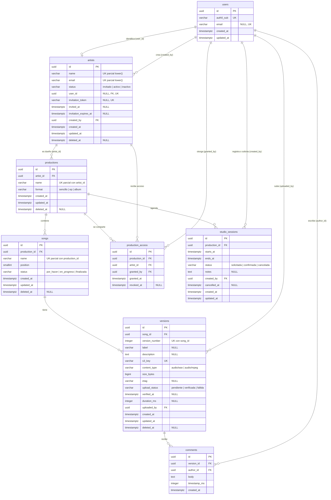

# Modelo de datos completo — Track Studio

> **Jira:** `TS-49` (`ts-38.01`..`ts-38.09`)
> **Base:** [`modelo-minimo-sprint-1.md`](modelo-minimo-sprint-1.md) (`TS-54`, cerrado) y [`modelo-sprint-2.md`](modelo-sprint-2.md) (delta de S2, slice de `productions` aprobado el 2026-10-05)
> **Estado:** **propuesta pendiente de aprobación humana** (corte 2 de `TS-49`).

## 1. Alcance y precedencia

Este documento fija el **diseño objetivo** de las ocho entidades del sistema: `users`, `artists`, `productions`, `songs`, `versions`, `comments`, `production_access` y `studio_sessions`. Aprobarlo cierra el ERD (ADR §6, «Estado del ERD»).

Aprobar el diseño **no autoriza a migrar**. Cada tabla se crea en la historia que la consume, con su spec aprobada y sus tests en rojo (§7). Hasta entonces sigue vigente el veto de `CLAUDE.md` §5.

Precedencia:

- Para `users`, `artists` y `productions` mandan los documentos de sprint (`modelo-minimo-sprint-1.md` y `modelo-sprint-2.md`). Aquí solo se resumen y se relacionan con el resto.
- Para `songs`, `versions`, `comments`, `production_access` y `studio_sessions` manda este documento. Cuando una historia materialice una de ellas, su spec puede ajustar detalles, pero **primero se actualiza este documento** en la misma sesión (regla dura 4).

Fuera del alcance (sin respaldo en RF): portada y porcentaje de avance de la producción, estado resuelto/pendiente, prioridad y respuestas de comentarios, varios estudios o salas, y edición o procesamiento de audio.

## 2. Invariantes globales

Valen para todas las tablas salvo que la entidad diga otra cosa.

| # | Invariante | Origen |
| --- | --- | --- |
| I1 | PK `id uuid`, generada por la aplicación (`HasUuids`); todas las FK son `uuid` (`foreignUuid()`). | D6.1 |
| I2 | Cada FK tiene un índice que la cubre como columna inicial y que no es parcial. | D6.7 |
| I3 | Ninguna FK usa `ON DELETE CASCADE` ni `SET NULL`; todas quedan en `NO ACTION`. Las cascadas son lógicas y viven en el Service. | D4.5 |
| I4 | Todos los instantes son `timestamptz` y se guardan en UTC. | D3.2 |
| I5 | Soft delete (`deleted_at`) **solo** en `artists`, `productions`, `songs` y `versions`. `comments` se borra físicamente, `production_access` se revoca y `studio_sessions` se cancela. | D4.5 |
| I6 | Los enums se guardan como `varchar` + `CHECK`, con valores en español, y se castean a backed enums de PHP. | D4.6, D6.3 |
| I7 | Los únicos de negocio que deben ignorar los borrados son índices únicos **parciales** (`WHERE deleted_at IS NULL` o `WHERE revoked_at IS NULL`). Los nombres se comparan con `lower()`. | D6.7 |
| I8 | No se guardan datos derivados (totales, conteos, avance). Se calculan. | `modelo-sprint-2.md` §5.1.4 |
| I9 | Nombres según el estándar de Laravel. | D6.6 |

## 3. Entidades

### 3.1 `users` — cerrada en `TS-54`

Identidad local de una cuenta de Auth0 (productor o artista). Diccionario completo en [`modelo-minimo-sprint-1.md`](modelo-minimo-sprint-1.md) §3.1: `id`, `auth0_sub` (único), `email` (nullable, único), `created_at`, `updated_at`. No persiste el rol (D4.8). **Sin cambios.**

Es el destino de las FK de autoría: `artists.created_by`, `artists.user_id`, `versions.uploaded_by`, `comments.author_id`, `production_access.granted_by` y `studio_sessions.created_by`.

### 3.2 `artists` — cerrada en `TS-54` y ampliada en `TS-16`

Diccionario en `modelo-minimo-sprint-1.md` §3.2 y delta en `modelo-sprint-2.md` §2–§3. **Sin cambios de esquema.**

**Catálogo de estados canónico** (decisión del humano del 2026-10-05): `invitado`, `activo` e `inactivo` (D6.3). Los AC de `TS-18` (HU-07) que hablan de «activo/suspendido/bloqueado» se corrigen en Jira para que coincidan con este catálogo.

`artists` es también el sujeto de los accesos (§3.7): un artista puede recibir acceso antes de tener cuenta, y su `user_id` lo enlaza con la identidad cuando se registra (D6.2, D6.4).

### 3.3 `productions` — aprobada el 2026-10-05

Diccionario, decisiones y migración en [`modelo-sprint-2.md`](modelo-sprint-2.md) §5. Resumen: `id`, `artist_id` (FK, índice), `name` (único parcial `(artist_id, lower(name))`), `format` (`sencillo | ep | album`), timestamps y `deleted_at`.

Reglas de formato por número de canciones vigentes: sencillo 1, EP 2–6, álbum ≥ 7, y solo bloquean los máximos (§5.1.5). Las aplica el Service al crear canciones (§3.4) y al cambiar el formato.

### 3.4 `songs`

**Propósito.** RF-03: HU-10 (alta, edición y borrado), HU-11 (listado con estado y posición) y HU-12 (borrado con confirmación y cascada). Sprint objetivo: S3.

**Diccionario.**

| Columna | Tipo PostgreSQL | Nulabilidad | Restricciones e índices | Propósito |
| --- | --- | --- | --- | --- |
| `id` | `uuid` | `NOT NULL` | PK | Identificador generado (AC de HU-10). |
| `production_id` | `uuid` | `NOT NULL` | FK → `productions.id`; índice `songs_production_id_index` | Producción a la que pertenece (AC de HU-10). |
| `name` | `varchar(255)` | `NOT NULL` | Único parcial `songs_production_id_name_lower_unique` sobre `(production_id, lower(name))` `WHERE deleted_at IS NULL` | Nombre único dentro de la producción (AC de HU-10). |
| `position` | `smallint` | `NOT NULL` | `CHECK (position > 0)`; sin único en BD | Orden dentro de la producción (HU-11). |
| `status` | `varchar(20)` | `NOT NULL` | `DEFAULT 'por_hacer'`; `CHECK (status IN ('por_hacer', 'en_progreso', 'finalizada'))` | Estado de avance (HU-11). |
| `created_at` | `timestamptz` | `NOT NULL` | — | Auditoría (D3.2). |
| `updated_at` | `timestamptz` | `NOT NULL` | — | Auditoría (D3.2). |
| `deleted_at` | `timestamptz` | `NULL` | — | Soft delete (D4.5). |

**Relaciones.** `productions` 1 — 0..N `songs`. `songs` 1 — 0..N `versions`.

**Integridad.**

- Máximo de canciones por formato (`modelo-sprint-2.md` §5.1.5): lo valida el Service al crear la canción, contando las vigentes de la producción. Si se supera, responde 422 (D3.1). La carrera entre dos altas simultáneas se acepta por la misma razón que el hallazgo A2 de `TS-16`: hay un único productor (D8.1).
- La posición la mantiene el Service: al crear una canción le asigna `max(position) + 1` entre las vigentes, y al reordenar o borrar compacta las posiciones.

**Ciclo de vida.** Se crea en `por_hacer`. El productor cambia el estado libremente entre los tres valores, sin una máquina de estados obligatoria. HU-12 la borra de forma lógica: el Service marca `deleted_at` en la canción **y** en sus versiones vigentes dentro de una transacción. El audio de S3 se conserva hasta la purga (D4.5).

**Autorización.** El productor crea, edita, reordena y borra. El artista solo consulta las canciones de producciones a las que tiene acceso vigente (HU-21).

**Decisiones y alternativas.**

| Decisión | Alternativa descartada | Motivo |
| --- | --- | --- |
| `position` sin único en BD | Único parcial `(production_id, position)` | Para reordenar habría que diferir la restricción, y los índices únicos parciales no admiten `DEFERRABLE`. Con un único productor, el Service basta. |
| Estado en `songs` | Derivar el estado de las versiones | HU-11 lo trata como un dato que el productor decide, no como algo calculado. |
| Comprobar el formato en el Service | Trigger en PostgreSQL | La regla es de negocio y necesita un 422 legible. Un trigger duplicaría la lógica y sería más difícil de testear con Pest. |

**Migración.** `create_songs_table` en `TS-21` (HU-10, S3).

### 3.5 `versions`

**Propósito.** RF-04: HU-13 (subida), HU-14 (versionado secuencial), HU-15 (reproducción) y HU-16 (URLs firmadas). Aplica D7.1–D7.7. Sprints objetivo: S3–S4.

**Diccionario.**

| Columna | Tipo PostgreSQL | Nulabilidad | Restricciones e índices | Propósito |
| --- | --- | --- | --- | --- |
| `id` | `uuid` | `NOT NULL` | PK | Identificador (D6.1). |
| `song_id` | `uuid` | `NOT NULL` | FK → `songs.id`; cubierto por el único `versions_song_id_version_number_unique` | Canción a la que pertenece. |
| `version_number` | `integer` | `NOT NULL` | `CHECK (version_number > 0)`; **único total** `(song_id, version_number)`, que incluye las filas borradas | Número secuencial, automático e inmodificable (HU-14, D7.3). |
| `label` | `varchar(100)` | `NULL` | — | Nombre corto opcional que escribe el productor al subir (p. ej., «Master final»). Si es `NULL`, el historial muestra «v{version_number}» (HU-14; decisión del humano del 2026-10-06). |
| `description` | `text` | `NULL` | — | Descripción opcional (HU-14). |
| `s3_key` | `varchar(512)` | `NOT NULL` | `UNIQUE` | `{artist_id}/{production_id}/{song_id}/v{version_number}.{ext}` (D7.3). |
| `content_type` | `varchar(50)` | `NOT NULL` | `CHECK (content_type IN ('audio/wav', 'audio/mpeg'))` | Tipo declarado y fijado como condición de la presigned URL (D7.7). El frontend normaliza las variantes (`audio/x-wav`, `audio/wave`) a `audio/wav`. La extensión del key se deriva de aquí (`wav`/`mp3`). |
| `size_bytes` | `bigint` | `NOT NULL` | `CHECK (size_bytes > 0 AND size_bytes <= 524288000)` | Tamaño declarado al firmar. Al verificar, el Service lo reemplaza por el `ContentLength` que devuelve `HeadObject`. Límite de 500 MB (D7.7). |
| `etag` | `varchar(64)` | `NULL` | — | ETag que devuelve S3, sin comillas (D7.4). |
| `upload_status` | `varchar(20)` | `NOT NULL` | `DEFAULT 'pendiente'`; `CHECK (upload_status IN ('pendiente', 'verificada', 'fallida'))` | Ciclo de subida y verificación (D7.4). |
| `verified_at` | `timestamptz` | `NULL` | — | Momento de la verificación con `HeadObject`. |
| `duration_ms` | `integer` | `NULL` | `CHECK (duration_ms > 0)` | Duración del audio que reporta el frontend al confirmar la subida. Solo se usa para acotar el timestamp de los comentarios (§3.6). |
| `uploaded_by` | `uuid` | `NOT NULL` | FK → `users.id`; índice `versions_uploaded_by_index` | Quién subió la versión (HU-13: el productor). |
| `created_at` | `timestamptz` | `NOT NULL` | — | Fecha que muestra el historial (HU-14). |
| `updated_at` | `timestamptz` | `NOT NULL` | — | Auditoría (D3.2). |
| `deleted_at` | `timestamptz` | `NULL` | — | Soft delete (D4.5, cascada de HU-12). |

Restricción entre columnas: `CHECK (upload_status <> 'verificada' OR (etag IS NOT NULL AND verified_at IS NOT NULL AND duration_ms IS NOT NULL))` (`versions_verified_complete_check`). Una versión verificada siempre tiene la evidencia de integridad y la duración.

**Relaciones.** `songs` 1 — 0..N `versions`. `versions` 1 — 0..N `comments`. `users` 1 — 0..N `versions` (`uploaded_by`).

**Integridad.**

- El único `(song_id, version_number)` es **total, no parcial**. Una versión borrada conserva su número, que no se reutiliza nunca: el historial no se reescribe y el key de S3 no colisiona (D7.3).
- `version_number` lo asigna el Service, nunca el cliente, dentro de una transacción que bloquea la fila de la canción (`SELECT … FOR UPDATE`) y calcula `max(version_number) + 1`, contando también las filas borradas y las fallidas. El único total es la última barrera.
- `s3_key` es único y se construye a partir de `version_number`, así que la fila y el objeto de S3 no pueden desincronizarse (D7.3).

**Ciclo de vida** (frontera de D7.1, D7.4 y D7.6):

1. **Firma (HU-13):** el Service reserva el número, crea la fila en `pendiente` con `content_type`, el `size_bytes` declarado y `s3_key`, y devuelve la presigned PUT (15 min, D7.6).
2. **Confirmación:** el frontend informa del ETag y de `duration_ms`. El Service llama a `HeadObject` mediante `HashVerifierContract` (D4.3) y, si el ETag coincide, pasa la fila a `verificada` con `etag`, `verified_at`, el `size_bytes` real y `duration_ms`. Si no coincide, pasa a `fallida`.
3. **Abandono:** una fila `pendiente` cuya URL caducó sin confirmarse puede pasar a `fallida`. El mecanismo (job programado o paso perezoso al consultar) lo decide la spec de HU-14. Su número queda consumido.
4. Solo las versiones `verificada` aparecen en el historial (HU-14), se reproducen (HU-15/16) y admiten comentarios (§3.6).

Que haya huecos en la numeración (por subidas fallidas) es un efecto aceptado: la numeración es estrictamente creciente, nunca retrocede y nunca se reutiliza. La verificación de integridad se **implementa** en S4 (`CLAUDE.md` §5); aquí solo se fijan sus columnas.

**Autorización.** El productor sube y borra. El productor y el artista con acceso vigente reproducen (HU-15, HU-21). Nadie edita `version_number`, `s3_key`, `etag` ni `size_bytes` mediante la API.

**Decisiones y alternativas.**

| Decisión | Alternativa descartada | Motivo |
| --- | --- | --- |
| Crear la fila al firmar (`pendiente`) | Crear la fila solo al confirmar | El key de S3 necesita `version_number` antes del PUT (D7.3). Reservar el número en la BD evita que dos subidas usen el mismo key. |
| Único total en `(song_id, version_number)` | Único parcial sin las filas borradas | Si se reutilizara un número, el historial y el key de S3 apuntarían a dos objetos distintos. |
| `duration_ms` en `versions` | `songs.duration_ms` o un total en `productions` | La duración es propiedad de cada archivo. El formato de la producción ya no depende de minutos (`modelo-sprint-2.md` §5.1.5). |
| `duration_ms` reportada por el frontend | Calcularla en el backend | El archivo nunca pasa por Railway (D7.1). El dato solo acota los comentarios, así que el riesgo de manipulación es bajo y queda acotado por RBAC. |
| `label` opcional con «v{n}» de respaldo | `label` obligatorio, o ninguna etiqueta salvo el número | Nombrar la versión resuelve el problema original del estudio (versiones sin nombre) sin obligar a escribir texto en cada subida. |
| `content_type` con `CHECK` cerrado | `varchar` libre | D7.7 admite exactamente WAV y MP3. Normalizar en el frontend mantiene la condición de la presigned URL determinista. |

**Migración.** `create_versions_table` en `TS-24` (HU-13, S3), con todas las columnas. La lógica de verificación llega en `TS-25`/`TS-27` (S4).

### 3.6 `comments`

**Propósito.** RF-05: HU-17 (comentar en una marca de tiempo), HU-18 (marcadores y listado ordenado) y HU-19 (navegar y borrar los propios). Sprint objetivo: S5.

**Diccionario.**

| Columna | Tipo PostgreSQL | Nulabilidad | Restricciones e índices | Propósito |
| --- | --- | --- | --- | --- |
| `id` | `uuid` | `NOT NULL` | PK | Identificador (D6.1). |
| `version_id` | `uuid` | `NOT NULL` | FK → `versions.id`; cubierto por el índice `comments_version_id_timestamp_ms_index` | Versión comentada. |
| `author_id` | `uuid` | `NOT NULL` | FK → `users.id`; índice `comments_author_id_index` | Autor (AC de HU-17). Solo él puede borrarlo (HU-19). |
| `body` | `text` | `NOT NULL` | `CHECK (length(btrim(body)) > 0)` | Texto obligatorio (AC de HU-17). |
| `timestamp_ms` | `integer` | `NOT NULL` | `CHECK (timestamp_ms >= 0)` | Marca de tiempo dentro del audio. |
| `created_at` | `timestamptz` | `NOT NULL` | — | Fecha de registro (AC de HU-17). |

No hay `updated_at` (los comentarios no se editan, HU-19; en el modelo, `UPDATED_AT = null`) ni `deleted_at` (§2, I5).

**Relaciones.** `versions` 1 — 0..N `comments`. `users` 1 — 0..N `comments` (`author_id`).

**Integridad.**

- `timestamp_ms <= versions.duration_ms`: lo valida el Service (422), porque PostgreSQL no admite `CHECK` contra otra tabla. Solo se comenta sobre versiones `verificada`, que siempre tienen `duration_ms` (§3.5).
- El índice compuesto `(version_id, timestamp_ms)` cubre la FK y sirve el orden de HU-18 sin un índice adicional.

**Ciclo de vida.** Se crea y no se modifica. Su autor lo borra físicamente (HU-19). Si su versión se borra de forma lógica, el comentario queda oculto con ella. Si la versión se purga físicamente, antes se borran sus comentarios (la FK lo impone, §2, I3).

**Autorización.** Comentan el productor y el artista con acceso vigente a la producción (HU-17, HU-21). Leen los mismos. Cada uno borra solo los suyos (`author_id = usuario`, HU-19).

**Decisiones y alternativas.**

| Decisión | Alternativa descartada | Motivo |
| --- | --- | --- |
| Borrado físico | Soft delete | D4.5 no incluye los comentarios, y HU-19 solo pide que el autor pueda borrar. Un comentario borrado no tiene valor de recuperación. |
| `timestamp_ms` entero en milisegundos | `numeric` en segundos | Es exacto y barato de comparar, y coincide con la precisión del reproductor. |
| Autor en `users` | Autor en `artists` | El productor también comenta y no es un artista. |

**Migración.** `create_comments_table` en `TS-28` (HU-17, S5).

### 3.7 `production_access`

**Propósito.** RF-06: HU-20 (otorgar y revocar con invitación) y HU-21 (vista restringida). Sprint objetivo: S6. Sustituye el sujeto `user_id` de D6.5 por `artist_id` (decisión del humano del 2026-10-05).

**Diccionario.**

| Columna | Tipo PostgreSQL | Nulabilidad | Restricciones e índices | Propósito |
| --- | --- | --- | --- | --- |
| `id` | `uuid` | `NOT NULL` | PK | Identificador (D6.1). |
| `production_id` | `uuid` | `NOT NULL` | FK → `productions.id`; índice `production_access_production_id_index` | Producción compartida. |
| `artist_id` | `uuid` | `NOT NULL` | FK → `artists.id`; índice `production_access_artist_id_index` | Artista que recibe el acceso, tenga o no cuenta todavía. |
| `granted_by` | `uuid` | `NOT NULL` | FK → `users.id`; índice `production_access_granted_by_index` | Productor que otorgó el acceso (auditoría, RNF-01). |
| `granted_at` | `timestamptz` | `NOT NULL` | — | Momento del otorgamiento. |
| `revoked_at` | `timestamptz` | `NULL` | `CHECK (revoked_at IS NULL OR revoked_at >= granted_at)` | Revocación. La fila no se borra (D6.5). |

Único parcial `production_access_active_unique` sobre `(production_id, artist_id)` `WHERE revoked_at IS NULL`: como mucho un acceso vigente por artista y producción, conservando todo el historial (D6.7). No tiene `created_at` ni `updated_at`: `granted_at` y `revoked_at` son las marcas del ciclo de vida.

**Relaciones.** `productions` 1 — 0..N `production_access`. `artists` 1 — 0..N `production_access`. `users` 1 — 0..N `production_access` (`granted_by`).

**Integridad y resolución del acceso.**

- **Acceso vigente:** existe una fila con `revoked_at IS NULL` (D6.5).
- **HU-21:** usuario autenticado → `artists.user_id` → `production_access.artist_id` con `revoked_at IS NULL` → `production_id`. Un artista con `status = 'inactivo'` no tiene acceso efectivo aunque tenga filas vigentes; la Policy lo comprueba.
- Volver a otorgar un acceso revocado crea una fila nueva y nunca reactiva la anterior.

**Ciclo de vida.** Al otorgar (HU-20) se crea la fila y se dispara la invitación. Si el artista todavía no tiene `user_id`, el Service emite el token de D6.4 (`artists.invitation_token`, `invited_at`, `invitation_expires_at`) y envía el correo por Resend (`MailerContract`). Si ya tiene cuenta, se le notifica el acceso nuevo. La revocación marca `revoked_at`.

**Autorización.** Solo el productor otorga y revoca. El artista ve sus propios accesos (D8.1). **Solo se concede acceso al artista dueño** de la producción (`production_access.artist_id = productions.artist_id`), porque los AC de HU-20 hablan de «su producción». Es una regla del Service de HU-20 (422 si no se cumple), no del esquema (decisión del humano del 2026-10-06).

**Decisiones y alternativas.**

| Decisión | Alternativa descartada | Motivo |
| --- | --- | --- |
| Sujeto `artist_id` | `user_id` (D6.5 original) | HU-20 otorga e invita en el mismo paso, cuando el artista puede no tener todavía una cuenta en Auth0. Con `user_id` haría falta un usuario ficticio o una FK nullable. |
| Pivote con historial | Columna `is_shared` en `productions` | RNF-01 necesita un historial auditable de quién tuvo acceso y cuándo. |
| Sin `revoked_by` | Registrar quién revoca | Hay un único productor (D8.1), que es quien otorga. Se puede añadir sin romper nada si aparece un segundo productor. |

La regla del dueño se aplica en el Service y no con una FK compuesta `(production_id, artist_id) → productions(id, artist_id)`. Así, si en el futuro se admiten colaboraciones (featurings), basta con cambiar el Service, sin migración.

**Migración.** `create_production_access_table` en `TS-31` (HU-20, S6).

### 3.8 `studio_sessions`

**Propósito.** RF-07: HU-22 (registrar, editar y cancelar sin solapes) y HU-23 (calendario del artista y solicitudes). Sprint objetivo: S6.

**Diccionario.**

| Columna | Tipo PostgreSQL | Nulabilidad | Restricciones e índices | Propósito |
| --- | --- | --- | --- | --- |
| `id` | `uuid` | `NOT NULL` | PK | Identificador (D6.1). |
| `production_id` | `uuid` | `NOT NULL` | FK → `productions.id`; índice `studio_sessions_production_id_index` | El «proyecto existente» del AC de HU-22 es una producción (decisión del humano del 2026-10-05). |
| `starts_at` | `timestamptz` | `NOT NULL` | Índice `studio_sessions_starts_at_index` (D6.7) | Inicio de la sesión (UTC, D3.2). |
| `ends_at` | `timestamptz` | `NOT NULL` | `CHECK (ends_at > starts_at)` | Fin de la sesión. |
| `status` | `varchar(20)` | `NOT NULL` | `CHECK (status IN ('solicitada', 'confirmada', 'cancelada'))`, sin default | Estado de la sesión (HU-22, HU-23). |
| `notes` | `text` | `NULL` | — | Notas opcionales de la sesión o de la solicitud. |
| `created_by` | `uuid` | `NOT NULL` | FK → `users.id`; índice `studio_sessions_created_by_index` | Productor que la registra o artista que la solicita. |
| `cancelled_at` | `timestamptz` | `NULL` | `CHECK ((status = 'cancelada') = (cancelled_at IS NOT NULL))` | Momento de la cancelación. |
| `created_at` | `timestamptz` | `NOT NULL` | — | Auditoría (D3.2). |
| `updated_at` | `timestamptz` | `NOT NULL` | — | Auditoría (D3.2). |

Restricción de exclusión `studio_sessions_no_overlap`:

```sql
EXCLUDE USING gist (tstzrange(starts_at, ends_at, '[)') WITH &&)
WHERE (status = 'confirmada')
```

Como hay un único estudio, el rango es la única dimensión y **no hace falta la extensión `btree_gist`**. El rango semiabierto `[)` permite sesiones contiguas (una termina a las 14:00 y otra empieza a las 14:00).

**Relaciones.** `productions` 1 — 0..N `studio_sessions`. `users` 1 — 0..N `studio_sessions` (`created_by`).

**Integridad.**

- **Sin solapes, en dos capas:** el Service comprueba primero y devuelve un 422 legible (la «alerta» de HU-22). La exclusión de PostgreSQL es la última barrera ante escrituras concurrentes; su violación (`23P01`) también se traduce a 422 (D3.1), no a 500.
- Solo las sesiones `confirmada` ocupan el calendario. Una solicitud puede solaparse con otra hasta que el productor la confirma; confirmarla aplica la regla.

**Ciclo de vida.** El productor registra directamente en `confirmada` (HU-22). El artista solicita en `solicitada` (HU-23), y el productor la confirma o la cancela. Cancelar marca `status = 'cancelada'` y `cancelled_at` tras una confirmación explícita en la interfaz (HU-22). No hay borrado: las sesiones pasadas y canceladas se quedan en el historial (AC de HU-23).

**Autorización.** El productor crea, edita, confirma y cancela cualquier sesión. El artista ve las sesiones de las producciones a las que tiene acceso vigente y crea solicitudes para ellas (HU-21, HU-23).

**Decisiones y alternativas.**

| Decisión | Alternativa descartada | Motivo |
| --- | --- | --- |
| `EXCLUDE` + Service | Validar solo en el Service | Dos escrituras concurrentes podrían solaparse (el mismo patrón que A2 de `TS-16`). La restricción es barata y declarativa. |
| `production_id NOT NULL` | Sesiones sin producción | El AC de HU-22 exige un proyecto existente. Los bloqueos genéricos del estudio no tienen respaldo en RF-07. |
| Cancelación como estado | Soft delete | HU-23 conserva el historial y la cancelación forma parte del dominio, no es un borrado. |
| Solicitud en la misma tabla | Tabla `session_requests` aparte | Una solicitud es una sesión en otro estado y comparte todos los atributos. |

**Migración.** `create_studio_sessions_table` en `TS-33` (HU-22, S6). La exclusión se crea con `DB::statement` dentro de la migración, porque el Schema Builder de Laravel no la expresa.

## 4. Diagrama completo



## 5. Trazabilidad RF/HU → entidad

| RF | HU (Jira) | Entidades | ADR |
| --- | --- | --- | --- |
| RF-01 Artistas | HU-05 (`TS-16`), HU-06 (`TS-17`), HU-07 (`TS-18`) | `artists`, `users`; `productions` para el listado de HU-06 | D6.2, D6.3, D6.4, D6.7 |
| RF-02 Producciones | HU-08 (`TS-19`), HU-09 (`TS-20`) | `productions`; `songs` para contar en las reglas de formato | D4.5, D4.6, D6.7 |
| RF-03 Canciones | HU-10 (`TS-21`), HU-11 (`TS-22`), HU-12 (`TS-23`) | `songs`; `versions` en la cascada de HU-12 | D4.5, D6.7 |
| RF-04 Versiones y audio | HU-13 (`TS-24`), HU-14 (`TS-25`), HU-15 (`TS-26`), HU-16 (`TS-27`) | `versions` | D4.3, D7.1–D7.7, D6.7 |
| RF-05 Comentarios | HU-17 (`TS-28`), HU-18 (`TS-29`), HU-19 (`TS-30`) | `comments`; `versions.duration_ms` | D4.5, D6.7 |
| RF-06 Acceso del artista | HU-20 (`TS-31`), HU-21 (`TS-32`) | `production_access`; `artists` (invitación de D6.4) | D6.4, D6.5, D6.7, D8.1 |
| RF-07 Sesiones | HU-22 (`TS-33`), HU-23 (`TS-34`) | `studio_sessions` | D6.7 |
| — (identidad) | HU-03 (`TS-14`), HU-04 (`TS-15`) | `users` | D4.8, D6.1 |

## 6. Inventario de restricciones e índices

| Tabla | Índices de FK | Únicos de negocio | `CHECK` / exclusión |
| --- | --- | --- | --- |
| `users` | — | `auth0_sub`, `email` | — |
| `artists` | `user_id` (único), `created_by` | `lower(name)` y `lower(email)` parciales, `invitation_token` | `status` |
| `productions` | `artist_id` | `(artist_id, lower(name))` parcial | `format` |
| `songs` | `production_id` | `(production_id, lower(name))` parcial | `position`, `status` |
| `versions` | `(song_id, version_number)` (único), `uploaded_by` | `(song_id, version_number)` total, `s3_key` | `version_number`, `content_type`, `size_bytes`, `upload_status`, `duration_ms`, verificada completa |
| `comments` | `(version_id, timestamp_ms)`, `author_id` | — | `body`, `timestamp_ms` |
| `production_access` | `production_id`, `artist_id`, `granted_by` | `(production_id, artist_id)` parcial vigente | `revoked_at >= granted_at` |
| `studio_sessions` | `production_id`, `created_by` | — | `ends_at > starts_at`, `status`, `cancelled_at`, exclusión de solapes; índice en `starts_at` |

Contención (D6.7): no se añaden más índices que los anteriores hasta que una medición de RNF-03 los justifique.

## 7. Materialización por sprint

| Tabla | Migra en | Estado |
| --- | --- | --- |
| `users`, `artists` | `TS-15` (S1), `TS-16` (S2) | Migradas |
| `productions` | `TS-19` (S2) | Slice aprobado, pendiente de Red/Green |
| `songs` | `TS-21` (S3) | Diseño de este documento |
| `versions` | `TS-24` (S3); verificación en `TS-25`/`TS-27` (S4) | Diseño de este documento |
| `comments` | `TS-28` (S5) | Diseño de este documento |
| `production_access`, `studio_sessions` | `TS-31`, `TS-33` (S6) | Diseño de este documento |

## 8. Verificación del diseño

El DDL derivado de §3 se ejecutó el 2026-10-05 contra el PostgreSQL de Sail dentro de `BEGIN … ROLLBACK`, sin dejar rastro y sin migraciones. Comprobaciones: que todo el DDL compila, incluidos los índices parciales con `lower()`, el `CHECK` entre columnas de `versions` y la exclusión de `studio_sessions`; los rechazos esperados (nombre duplicado, número de versión repetido aunque la anterior esté borrada, versión verificada sin ETag, comentario vacío, segundo acceso vigente, sesión confirmada que se solapa, borrado físico de un padre con hijos); y las aceptaciones esperadas (reutilizar el nombre de una fila borrada, sesiones contiguas, una solicitud solapada, volver a otorgar un acceso tras revocarlo).

## 9. Aprobación

- **Propuesta:** 2026-10-05 (corte 2 de `TS-49`).
- **Aprobado por:** _pendiente_.

Al aprobarse, se actualizan en la misma rama: D6.5/D6.7/D4.6 y el «Estado del ERD» del ADR (pasa a CERRADO), `sprint-02.md` y Jira (`TS-49`, `TS-18`, `TS-20` y las notas obsoletas del bloque 7 en `TS-21`..`TS-33`).
