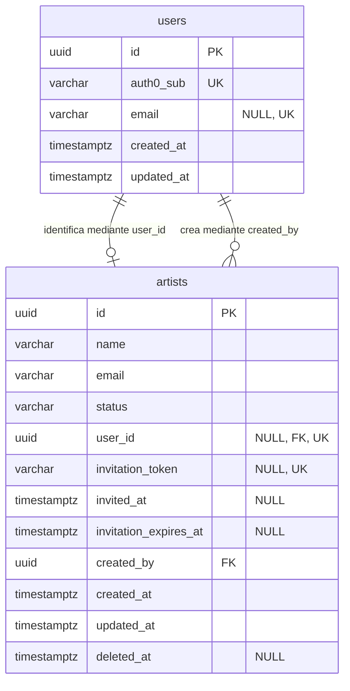

# Modelo mínimo de datos del Sprint 1

> **Jira:** `TS-54` · **Aprobado:** 2026-10-01 · **Alcance consumidor:** `TS-15` (`ts-04.01` y `ts-04.03`)
> **Estado:** aprobado para `users` y `artists`; no cierra el ERD completo de `TS-49`.

## 1. Alcance

Este documento es la fuente de verdad del subconjunto del ERD que se puede migrar en el Sprint 1. Incluye únicamente `users` y `artists`, conforme a D6.1–D6.7.

Quedan fuera:

- `production_access`, diferida hasta que se modele `productions`.
- `productions`, `songs`, `versions`, `comments` y `studio_sessions`, que continúan fuera del alcance del Sprint 1.
- Las migraciones y los modelos Eloquent: corresponden a `TS-15`, después de aprobar su spec y escribir los tests en rojo.

## 2. Decisiones del modelo mínimo

### 2.1 `users.email` es nullable y único

El access token validado por el backend garantiza `sub` y el claim de rol, pero no garantiza `email`. Por ello, la identidad local puede nacer a partir de `auth0_sub` sin inventar un correo ni confiar en datos enviados por el cliente.

Cuando exista un correo obtenido de una fuente verificada, debe ser único. La restricción `UNIQUE` estándar de PostgreSQL permite varias filas con `NULL`, pero impide repetir los valores no nulos.

### 2.2 El rol no se persiste en `users`

El claim namespaced del JWT es la fuente autoritativa del rol (D4.8). Persistir además una columna `role` crearía una segunda fuente que podría quedar desactualizada. `TS-15` autoriza usando el enum `Role` construido desde el token, no una columna de la base de datos.

### 2.3 `production_access` se difiere

La tabla requiere una FK hacia `productions`, entidad fuera del Sprint 1. D6.5 conserva su diseño lógico y D6.7 conserva el índice único parcial previsto, pero `TS-15` no crea ni simula esa tabla. La autorización demostrativa de HU-04 depende del rol del JWT, no de accesos a producciones todavía inexistentes.

## 3. Diccionario de datos

### 3.1 `users`

| Columna | Tipo PostgreSQL | Nulabilidad | Restricciones e índices | Propósito |
| --- | --- | --- | --- | --- |
| `id` | `uuid` | `NOT NULL` | PK | Identificador no enumerable (D6.1). |
| `auth0_sub` | `varchar(255)` | `NOT NULL` | `UNIQUE` | Identidad estable de Auth0 y clave de búsqueda por request. La restricción única aporta el índice requerido. |
| `email` | `varchar(255)` | `NULL` | `UNIQUE` | Correo verificado cuando esté disponible; admite varias filas todavía sin correo. |
| `created_at` | `timestamptz` | `NOT NULL` | — | Auditoría en UTC (D3.2). |
| `updated_at` | `timestamptz` | `NOT NULL` | — | Auditoría en UTC (D3.2). |

La tabla no contiene `name`, `role`, `password`, `remember_token` ni credenciales o tokens de Auth0. Tampoco existe `password_reset_tokens` en este modelo.

### 3.2 `artists`

| Columna | Tipo PostgreSQL | Nulabilidad | Restricciones e índices | Propósito |
| --- | --- | --- | --- | --- |
| `id` | `uuid` | `NOT NULL` | PK | Identificador no enumerable (D6.1). |
| `name` | `varchar(255)` | `NOT NULL` | — | Nombre de catálogo del artista. |
| `email` | `varchar(255)` | `NOT NULL` | — | Dirección usada para la invitación. No es identidad de autenticación ni se asume única. |
| `status` | `varchar(20)` | `NOT NULL` | `DEFAULT 'invitado'`; `CHECK (status IN ('invitado', 'activo', 'inactivo'))` | Estado definido por D6.3 y casteado al enum nativo de PHP. |
| `user_id` | `uuid` | `NULL` | FK → `users.id`; `UNIQUE` | Enlace opcional y uno-a-uno con la cuenta Auth0 (D6.2). La restricción única aporta el índice de la FK. |
| `invitation_token` | `varchar(255)` | `NULL` | `UNIQUE` | Token de invitación definido por D6.4. |
| `invited_at` | `timestamptz` | `NULL` | — | Momento de emisión de la invitación. |
| `invitation_expires_at` | `timestamptz` | `NULL` | — | Caducidad de la invitación. |
| `created_by` | `uuid` | `NOT NULL` | FK → `users.id`; índice no único | Usuario productor que creó el registro. |
| `created_at` | `timestamptz` | `NOT NULL` | — | Auditoría en UTC (D3.2). |
| `updated_at` | `timestamptz` | `NOT NULL` | — | Auditoría en UTC (D3.2). |
| `deleted_at` | `timestamptz` | `NULL` | — | Soft delete conforme a D4.5. |

Las FK no usan `ON DELETE CASCADE`; cualquier efecto relacionado se coordina explícitamente desde la capa de Service (D4.5).

## 4. Relaciones

## 5. Alternativas descartadas

| Alternativa | Motivo de descarte |
| --- | --- |
| `users.email NOT NULL` desde el primer request | El access token no garantiza ese claim; obligaría a consultar otra API, confiar en el cliente, preaprovisionar todas las cuentas o inventar un valor. |
| Guardar `users.role` | Duplica el claim de Auth0 y permite drift entre autorización y persistencia. |
| Crear `production_access` sin `productions` | Introduce una FK sin entidad propietaria o exige una tabla ficticia, ambas fuera del alcance acordado. |
| Reutilizar la migración Laravel de contraseñas | Contradice D4.8 y el criterio de no almacenar credenciales propias. |

## 6. Consecuencias para `TS-15`

- La migración inicial de Laravel debe reemplazarse, no extenderse: elimina las columnas y tablas de autenticación por contraseña.
- Solo se crean las tablas `users` y `artists` de este documento.
- La provisión local puede identificar al usuario exclusivamente por `auth0_sub`; completar `email` requiere una fuente verificada y no bloquea el primer enlace.
- RBAC usa el rol del JWT; ninguna consulta a `users.role` es válida.
- `production_access` no aparece en migraciones, modelos ni tests de HU-04.

## 7. Trazabilidad

- `TS-54`: aprobación de este subconjunto.
- `TS-15`: consumidor del modelo aprobado y responsable de sus migraciones después de Red.
- `TS-49`: dueño del ERD completo pendiente.
- ADR: D3.2, D4.5, D4.8 y D6.1–D6.7.
