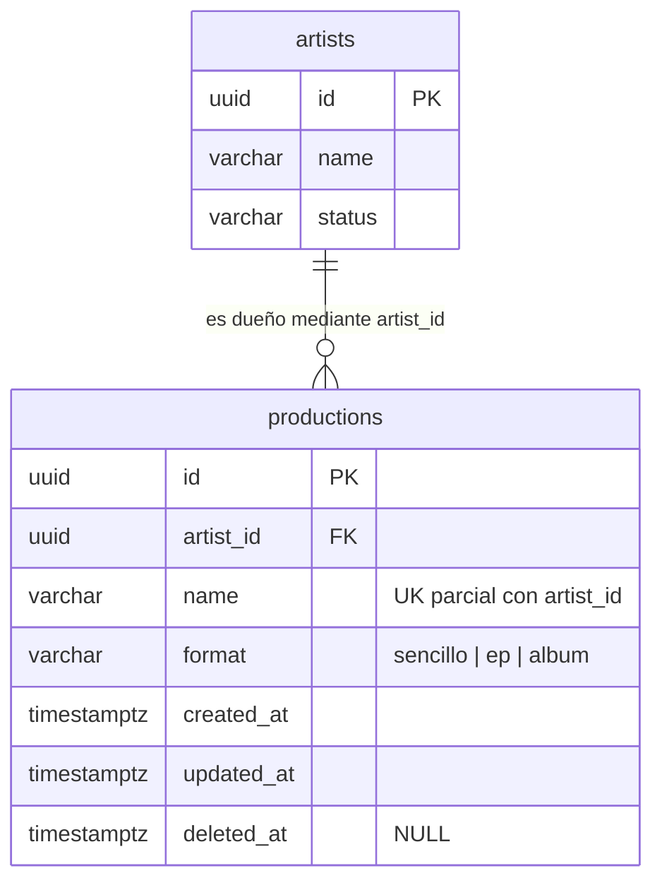

# Modelo de datos del Sprint 2 — ampliaciones

> **Jira:** `TS-16` (HU-05) · `TS-49`, slice de `productions` (`ts-08.10`)
> **Base:** [`modelo-minimo-sprint-1.md`](modelo-minimo-sprint-1.md) (`TS-54`, cerrado)
> **Estado:** la ampliación de `artists` (§2–§4) se integró con `TS-16` (PR #30). El slice de `productions` (§5) es una **propuesta pendiente de aprobación humana**.

## 1. Alcance

Este documento es un **delta**: recoge solo lo que el Sprint 2 cambia o añade sobre el modelo de S1. Lo que no aparece aquí sigue exactamente como lo define `modelo-minimo-sprint-1.md`. Cuando ambos documentos difieren, prevalece este.

Hoy cubre:

- `artists`: unicidad de negocio de `name` y `email` (`TS-16`).
- `productions`: tabla nueva, slice de `TS-49` (`ts-08.10`) que debe aprobarse antes de implementar `TS-19` (§5).

Siguen fuera de S2: `songs`, `versions`, `comments`, `studio_sessions` y `production_access` (`CLAUDE.md` raíz §5).

## 2. Decisiones

### 2.1 `artists.name` y `artists.email` son únicos entre los artistas vigentes (`TS-16`, 2026-10-04)

El criterio de aceptación de HU-05 exige unicidad de nombre y email. Sustituye la afirmación de S1 de que `artists.email` «no se asume único».

- **Sin distinguir mayúsculas:** `Ana@Correo.com` y `ana@correo.com` son el mismo correo; `J Balvin` y `j balvin`, el mismo nombre. La comparación se hace tras recortar espacios.
- **Solo entre filas vigentes** (`deleted_at IS NULL`): un artista con soft delete (D4.5) libera su nombre y su correo. Un artista `inactivo` sigue vigente y los conserva.
- **La base de datos es la última barrera:** índices únicos parciales `artists_name_lower_unique` sobre `lower(name)` y `artists_email_lower_unique` sobre `lower(email)`, ambos con `WHERE deleted_at IS NULL`. La validación amigable (422) vive en la capa de aplicación; el índice impide el duplicado aunque dos altas compitan.

### 2.2 El registro no emite invitación (`TS-16`, 2026-10-04)

`invitation_token`, `invited_at` e `invitation_expires_at` siguen siendo nullable y quedan en `NULL` al registrar un artista. La invitación la emite el flujo de acceso del artista (HU-20), con Resend disponible en S5. Ver la nota de 2026-10-04 en D6.4.

## 3. Cambios al diccionario de `artists`

Solo se listan las filas que cambian respecto a S1.

| Columna | Tipo PostgreSQL | Nulabilidad | Restricciones e índices | Propósito |
| --- | --- | --- | --- | --- |
| `name` | `varchar(255)` | `NOT NULL` | Único parcial `artists_name_lower_unique` sobre `lower(name)` `WHERE deleted_at IS NULL` (§2.1) | Nombre de catálogo del artista. |
| `email` | `varchar(255)` | `NOT NULL` | Único parcial `artists_email_lower_unique` sobre `lower(email)` `WHERE deleted_at IS NULL` (§2.1) | Dirección de contacto e invitación. No es identidad de autenticación. |
| `invitation_token` | `varchar(255)` | `NULL` | `UNIQUE` (sin cambios) | Token de invitación definido por D6.4; nace en HU-20, no en el registro (§2.2). |

## 4. Migración

`add_unique_name_and_email_indexes_to_artists_table`, con una sola intención: crea los dos índices de §2.1 y no toca columnas ni otras tablas. Su `down()` elimina exactamente esos dos índices.

## 5. Slice de `productions` (`TS-49`, propuesta del 2026-10-05)

Cubre RF-02: HU-08 (`TS-19`) y HU-09 (`TS-20`). Los AC de HU-08 exigen que la producción esté siempre asociada a un artista existente, que tenga un formato álbum/EP/sencillo y que su identificador lo genere el sistema.

### 5.1 Decisiones

1. **Toda producción pertenece a un artista.** `artist_id` es `NOT NULL` y su FK apunta a `artists.id`. La FK no tiene `ON DELETE CASCADE` (D4.5); el valor por defecto de PostgreSQL (`NO ACTION`) impide borrar físicamente un artista que tenga producciones. Ninguna HU borra artistas (HU-05..07 registran, editan, listan y cambian el estado). Si alguna vez se borra uno de forma lógica, el Service decide qué pasa con sus producciones.
2. **El formato es un enum cerrado** con valores en español, igual que `artists.status` (D6.3): `sencillo`, `ep` y `album`. Se guarda como `varchar` con `CHECK` y se castea a un backed enum de PHP (D4.6), validado con `Rule::enum()`.
3. **El nombre es único dentro del artista y solo entre las producciones vigentes**, con el mismo criterio que §2.1: no distingue mayúsculas, la aplicación recorta espacios antes de comparar, y una producción con soft delete libera su nombre. Dos artistas distintos pueden tener producciones con el mismo nombre. La validación amigable (422) vive en la aplicación; el índice es la última barrera.
4. **No se guarda ningún dato derivado.** Quedan fuera la duración total, el número de canciones, el porcentaje de avance y la portada (este último lo excluye TS-19). Las reglas de formato se calculan contando las canciones vigentes cuando haga falta.
5. **Las reglas de formato cuentan canciones, no minutos** (decisión del humano del 2026-10-05, que sustituye el AC «EP no supera 30 min» de `TS-20`): sencillo = 1 canción, EP = 2 a 6, álbum = 7 o más. **Solo bloquean los máximos**: no se puede añadir una canción que supere el máximo del formato ni cambiar a un formato que no admite las canciones que ya existen. Los mínimos son informativos mientras la producción está en curso. El esquema no necesita columnas para esto. El dueño del contrato funcional es la spec de HU-09. En S2 no existe `songs`, así que toda producción tiene 0 canciones y el cambio de formato siempre es válido; el bloqueo al añadir canciones llega con HU-10 (S3).
6. **Borrado lógico** (`deleted_at`, D4.5). La cascada lógica hacia `songs` y `versions` la hará el Service cuando esas tablas existan (HU-12, S3). Los objetos de S3 no se tocan (D4.5).
7. **Sin `created_by`.** Hay un único productor (D8.1) y ningún AC pide auditar quién crea la producción. `artists.created_by` existe por el enlace de cuentas de S1, y ese motivo no aplica aquí.
8. **La regla «¿se puede crear una producción para un artista `inactivo`?»** es de negocio, no de esquema. La decide la spec de HU-08. Lo mas probable es que sea no.

### 5.2 Diccionario de `productions`

| Columna | Tipo PostgreSQL | Nulabilidad | Restricciones e índices | Propósito |
| --- | --- | --- | --- | --- |
| `id` | `uuid` | `NOT NULL` | PK | Identificador no enumerable generado por el sistema (D6.1, AC de HU-08). |
| `artist_id` | `uuid` | `NOT NULL` | FK → `artists.id` (sin cascada); índice `productions_artist_id_index` | Artista dueño de la producción (§5.1.1). Índice explícito de la FK (D6.7). |
| `name` | `varchar(255)` | `NOT NULL` | Único parcial `productions_artist_id_name_lower_unique` sobre `(artist_id, lower(name))` `WHERE deleted_at IS NULL` (§5.1.3) | Nombre de la producción. |
| `format` | `varchar(10)` | `NOT NULL` | `CHECK (format IN ('sencillo', 'ep', 'album'))`, sin default | Formato de la producción (§5.1.2). El productor lo elige siempre de forma explícita. |
| `created_at` | `timestamptz` | `NOT NULL` | — | Auditoría en UTC (D3.2). |
| `updated_at` | `timestamptz` | `NOT NULL` | — | Auditoría en UTC (D3.2). |
| `deleted_at` | `timestamptz` | `NULL` | — | Soft delete (D4.5). |

El único parcial empieza por `artist_id`, pero **no sustituye** al índice de la FK: al ser parcial, deja fuera las filas borradas. Por eso `productions_artist_id_index` se declara aparte.

### 5.3 Relaciones

### 5.4 Alternativas descartadas

| Alternativa | Motivo de descarte |
| --- | --- |
| Formato limitado por duración (EP ≤ 30 min) | Obliga a conocer la duración del audio antes de que exista (S4) y castiga a los EP con canciones largas. Se sustituye por el número de canciones (§5.1.5). |
| Guardar `total_duration` o `songs_count` en `productions` | Es un dato derivado que puede desincronizarse. Se calcula. |
| Nombre único global | Dos artistas pueden tener producciones con el mismo nombre (p. ej., «Demos»). |
| Enum nativo de PostgreSQL (`CREATE TYPE`) | Añadir o quitar valores exige DDL especial. `varchar` + `CHECK` sigue el patrón de `artists.status`. |
| `created_by` | Sin necesidad de auditoría concreta (§5.1.7). |
| `ON DELETE CASCADE` desde `artists` | Contradice D4.5: el borrado es lógico y la cascada es explícita en el Service. |

### 5.5 Migración

`create_productions_table`, con una sola intención: crea la tabla de §5.2 con su FK, el índice de la FK, el único parcial y el `CHECK` de formato. No toca otras tablas. Su `down()` elimina la tabla. La escribe el humano en `TS-19` (`ts-08.03`), después de que la spec esté aprobada y los tests estén en rojo.

## 6. Trazabilidad

- `TS-16`: consumidor de §2.1 y §2.2, responsable de la migración de §4 después de Red.
- `TS-49`: dueño del ERD completo; aporta el slice de §5 (`ts-08.10`; `ts-38.02`, `ts-38.03` y `ts-38.05` para `productions`).
- `TS-19` (HU-08): consumidor de §5 y responsable de la migración de §5.5.
- `TS-20` (HU-09): dueño del contrato funcional de §5.1.5.
- RF: RF-01 (§2–§4) y RF-02 (§5).
- ADR: D3.2 (UTC), D4.5 (soft delete), D4.6 (enums), D6.1 (UUID), D6.3 (patrón de estados), D6.4 (nota del 2026-10-04), D6.7 (índice de FK y únicos de negocio) y D8.1 (un único productor).
